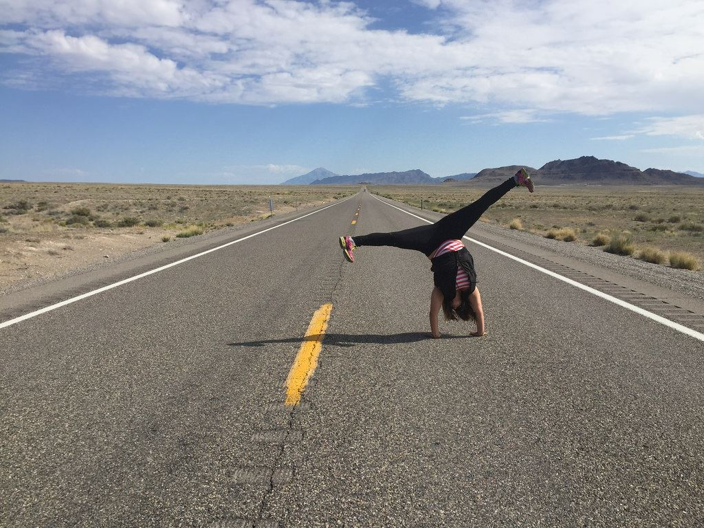

</img>

<table align="right">
 <tr><td><a href="README.md"> Português</a></td></tr>
 <tr><td><a href="README_fr.md"> English</a></td></tr>
 <tr><td><a href="README_pt.md"> Hebrew</a></td></tr>
</table>

### :space_invader: &nbsp;About Me

&nbsp;&nbsp;&nbsp;:hammer_and_wrench: &nbsp; I'm a Full Stack Developer from 2021 with marketing & business expertise.\
&nbsp;&nbsp;&nbsp;:technologist: &nbsp;Currently looking for my next challenge, and enjoying the jorney!\
&nbsp;&nbsp;&nbsp;:coffee: &nbsp;Morning routine: Turkish coffee & LeetCode\
&nbsp;&nbsp;&nbsp;:writing_hand: &nbsp;Always learning!\
&nbsp;&nbsp;&nbsp;😄 "Smile is the only language that everyone understands".However my code is pretty readable too 😅.\
&nbsp;&nbsp;&nbsp;👩‍❤️‍👩 Living in Tel Aviv with my wonderful wife :two_hearts:, and our plants 🪴\
&nbsp;&nbsp;&nbsp;&nbsp;🥋 Huge fan of martial arts.\
&nbsp;&nbsp;&nbsp;&nbsp;🏉 Fan fact: Had the joy to play Rugby in Ireland\
&nbsp;&nbsp;&nbsp;&nbsp;🥘 Definitely a foodie!

  &nbsp;&nbsp;&nbsp;&nbsp;
 &nbsp;&nbsp;&nbsp;&nbsp;

  
<b>:computer: &nbsp;Main tech knowledge</b>

   

&nbsp;
&nbsp;
&nbsp;
&nbsp;
&nbsp;
&nbsp;\
&nbsp;
&nbsp;

&nbsp;
&nbsp;
&nbsp;

  
<b>:brain: &nbsp;Other curiositie | Always learning</b>

   

&nbsp;
&nbsp;

  
<b> 🗣️ &nbsp;Want to reach out? Check out my portfolio!</b>

   

 
 
 
 

 
 
Cheers! 
